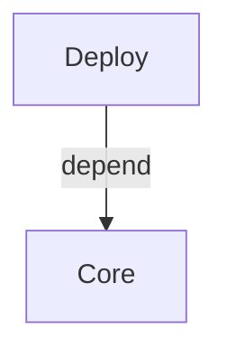

# Medilab Design 

## Micro-services:

- **Deploy**: Responsible for launching the application.
- **Core**: Contains the application logic

## Diagrams

```mermaid
graph TD
    deploy[Deploy]
    core[Core]

    deploy --> |depend| core
```