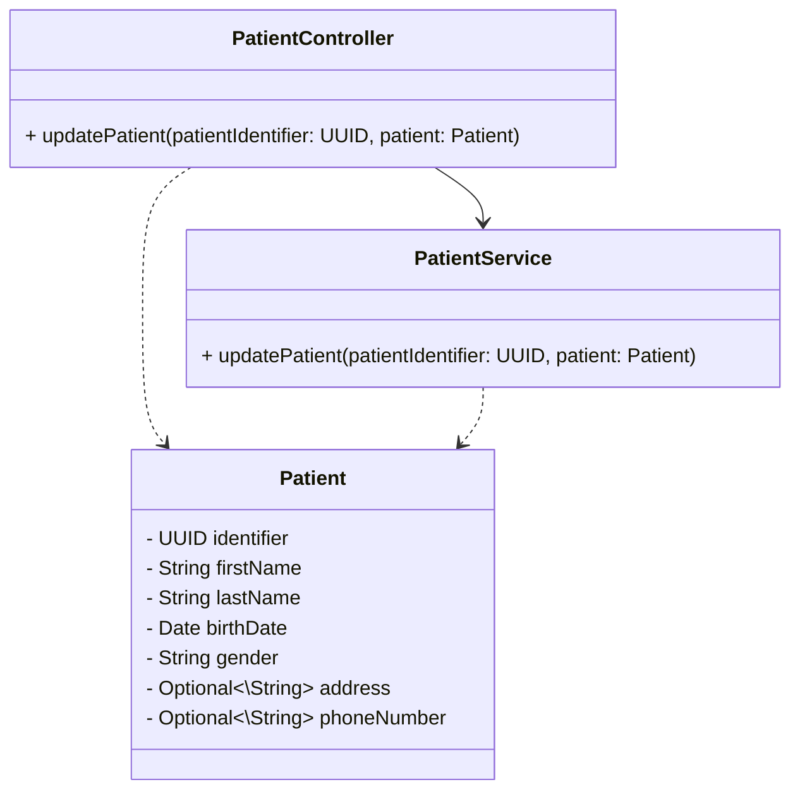

# Medilab - Backend design documentation

```mermaid
classDiagram
    class PatientController {
        + updatePatient(patientIdentifier: UUID, patient: Patient)
    }

    class PatientService {
        + updatePatient(patientIdentifier: UUID, patient: Patient)
    }

    class Patient {
        - UUID identifier
        - String firstName
        - String lastName
        - Date birthDate
        - String gender
        - Optional<\String> address
        - Optional<\String> phoneNumber
    }

    PatientController --> PatientService

    PatientController ..> Patient
    PatientService ..> Patient

```