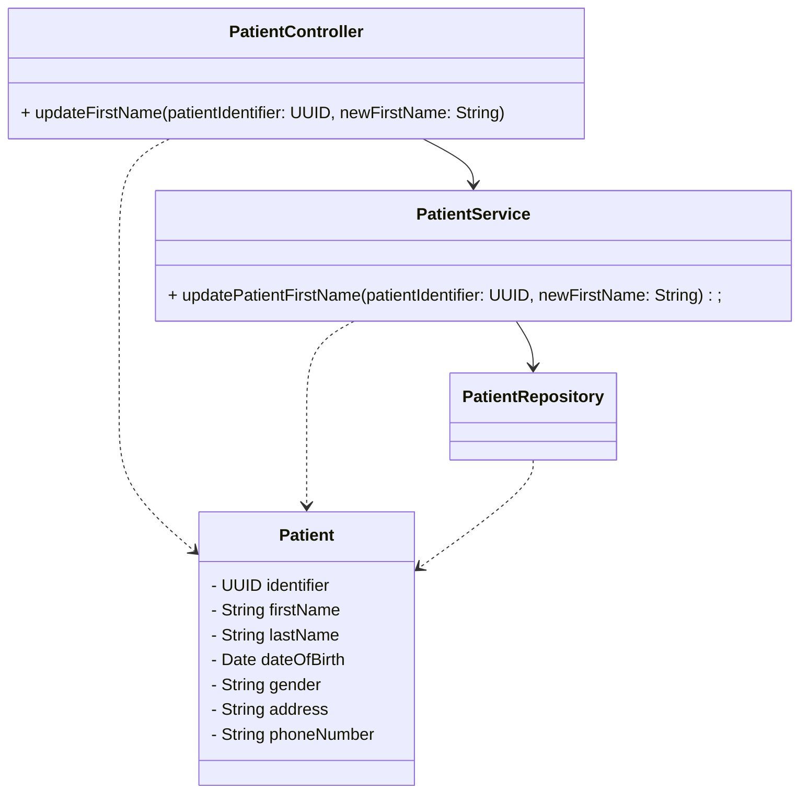

# Medilab - Backend design documentation

```mermaid
classDiagram
    class PatientController {
        + updateFirstName(patientIdentifier: UUID, newFirstName: String)
    }

    class PatientService {
        + updatePatientFirstName(patientIdentifier: UUID, newFirstName: String);
    }

    class PatientRepository 

    class Patient {
        - UUID identifier
        - String firstName
        - String lastName
        - Date dateOfBirth
        - String gender
        - String address
        - String phoneNumber
    }

    PatientController --> PatientService
    PatientService --> PatientRepository

    PatientController ..> Patient
    PatientService ..> Patient
    PatientRepository ..> Patient

```